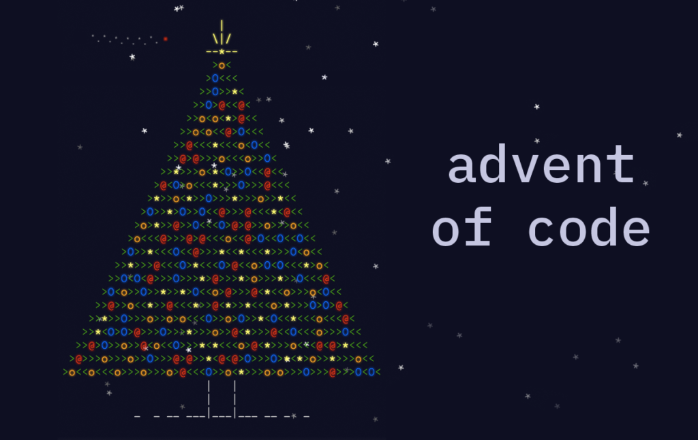

# Advents of Code

    

[Advent of Code](https://adventofcode.com/) is a web challenge based upon a advent calendar but for developers.

Every day a challenge to solve. No programming language imposed.

My solutions can be found [here](https://mtouzot.github.io/advents-of-code/)

## Credits & Copyright

Advent of Code is only **free to use**, the [About page](https://adventofcode.com/about) answers the [copy/redistribute](https://adventofcode.com/about#faq_copying) part.

Favicons can be found on <a href="https://www.flaticon.com/fr/icones-gratuites/biscuit-de-noel" title="biscuit-de-noel icônes">Freepik - Flaticon</a>

The documation page hosted on Github Page is a [personnal fork](https://github.com/mtouzot/jekyll-latex.git) of Ryan McDermott's [jekyll-latex theme](https://github.com/ryanmcdermott/jekyll-latex)